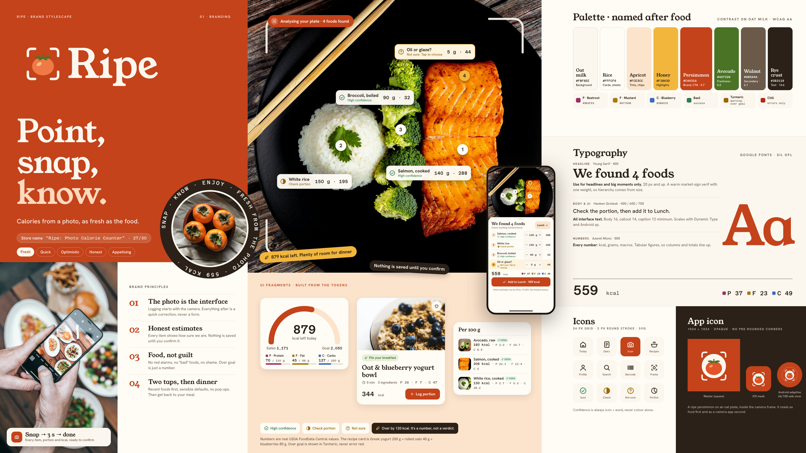

# Ripe: brand guide

**Ripe** is a calorie calculator that starts with a photo. You point your phone at your plate, and Ripe finds each food, estimates the portion, and shows how sure it is. You check the numbers, tap once, and get back to your meal.

- Stylescape: [stylescape.html](stylescape.html) · [stylescape.png](stylescape.png) (3840×2160)
- How we chose this direction: [directions.md](directions.md) (Direction A, score 19 of 20)
- Research behind it: [../process/research.md](../process/research.md)



---

## 1. The idea in one line

> **Point, snap, know.** Calories from a photo, as fresh as the food.

Other calorie apps feel like spreadsheets: you type, search and scroll. Ripe turns this around. **The photo is the interface.** Everything after the photo is a quick check, never a form.

## 2. Who it's for

Busy adults aged 24–40 who eat a mix of home cooking and takeaway. They tried typing every ingredient and gave up. They want a fast estimate **they can trust and fix**. They don't want a diet coach telling them off.

## 3. Personality

**Fresh · Quick · Optimistic · Honest · Appetising**

If Ripe were a person, it would be a friend at the farmers' market: cheerful, fast, and honest when it isn't sure.

## 4. Brand principles

1. **The photo is the interface.** Logging starts with the camera. Everything after is a quick correction.
2. **Honest estimates.** Every detected food shows how sure we are (High · Check portion · Not sure). Nothing is saved until you confirm it.
3. **Food, not guilt.** No red alarms, no "bad" foods, no shame. Going over your goal is just a number. We default to your maintenance calories and never suggest extreme deficits.
4. **Two taps, then dinner.** Recent foods first, sensible defaults, no pop-ups.

---

## 5. Colour: why these colours

People connect warm colours (orange, red, yellow) with ripe fruit, cooking and appetite. Green feels fresh and natural. Soft off-whites feel like oat milk, rice and paper; pure white with cold blue feels like a hospital. Most calorie apps use blue or green. **Ripe uses the colours of food itself**, so it looks different and feels appetising.

Every colour is named after a food, and every text colour passes **WCAG AA** (at least 4.5:1 for text, 3:1 for UI shapes) on the Oat milk background.

| Colour | HEX | Used for | Why this food |
|---|---|---|---|
| **Oat milk** | `#FBF6EE` | App background | Warm and creamy, never clinical. We never use pure white |
| **Rice** | `#FFFCF6` | Cards and sheets | A slightly lighter off-white for depth |
| **Rye crust** | `#2B2118` | Main text, icons (14.6:1) | The dark brown of baked bread, softer than black |
| **Walnut** | `#6B5A4A` | Secondary text (6.1:1) | Quiet and nutty, for less important info |
| **Persimmon** | `#C4431A` | Brand colour, main buttons (white text 5.0:1) | A ripe fruit, the strongest appetite colour |
| **Apricot** | `#FCE3CC` | Soft tints, selected chips | Gentle fruit flesh |
| **Avocado** | `#4A7326` | "Fits your day", freshness (5.2:1) | Fresh green that balances the orange |
| **Honey** | `#F2B63D` | Highlights, the "not sure" marker (fill only) | Golden and warm |

**Macro colours.** Protein, fat and carbs each get their own colour. We tested all three with colour-blindness simulations, and they stay clearly different for every type. We also **always write P / F / C with the number**, so colour is never the only clue.

| Macro | Colour | HEX |
|---|---|---|
| Protein | Beetroot | `#9B2F63` |
| Fat | Mustard | `#A77A0B` |
| Carbs | Blueberry | `#3B6CC0` |

Blueberry is the only blue in the brand, and it's used only for data, never for large areas.

**Status colours.** These are taken from food too, and darkened for readability:
- **Basil** `#2E7D4F`: success, high confidence.
- **Turmeric** `#9A6400`: "check portion" and **over goal**.
- **Chili** `#B3261E`: real errors only, for example "we couldn't recognise this photo". Going over goal is **never** red.

## 6. Typography: why these fonts

All three fonts are free Google Fonts under the SIL Open Font License, so they're safe for the App Store and Google Play.

| Role | Font | Why |
|---|---|---|
| **Headlines** | **Young Serif** | A warm, chunky serif that feels like a hand-painted market sign. It gives Ripe character. It has only one weight, so we use it for headlines and big moments only (20 px and up). |
| **Body and UI** | **Hanken Grotesk** | Clear and friendly at small sizes. Body text is 16, and nothing goes below 12. It scales with iOS Dynamic Type and Android font size. |
| **Numbers** | **Azeret Mono** | Every number (kcal, grams, macros) uses tabular figures, so columns and totals line up and are easy to compare. |

**Type scale** (size/line height, px):

| Style | Font | Size |
|---|---|---|
| Display | Young Serif | 40/44 |
| H1 | Young Serif | 28/34 |
| H2 | Young Serif | 22/28 |
| Title | Hanken 600 | 18/24 |
| Body | Hanken | 16/24 |
| Callout | Hanken | 14/20 |
| Caption | Hanken | 12/16 |
| Big number | Azeret | 44/48 |

## 7. Logo

**Files** in `assets/logo/`:
- `ripe-logo.svg`: the main logo, on light backgrounds.
- `ripe-logo-on-persimmon.svg`: the reversed logo, on the brand colour.
- `ripe-symbol.svg`: the symbol only.
- `ripe-wordmark.svg`: the name only.

**What it means:** a **ripe persimmon inside a camera frame**. The fruit says *food*, and the frame says *photo*. Together they show exactly what the app does.

The wordmark is **Young Serif converted to outlines**, so the logo looks the same everywhere without the font installed.

**Rules**
- Leave clear space around the logo at least the height of the "i" dot × 2.
- The minimum size is 24 px tall on screen for the symbol and 20 px for the wordmark.
- Use it on Oat milk, Rice or Persimmon only. Don't put it on photos without a solid panel behind it.
- Don't stretch it, recolour the fruit, add shadows, or put the fruit outside the frame.

## 8. App icon

**Files** in `assets/logo/`: `ripe-app-icon-1024.svg`, `ripe-android-foreground.svg` and `ripe-android-background.svg`.

- **iOS:** a 1024×1024 square with **no transparency and no rounded corners**. Apple adds the rounded mask itself.
- **Android:** an adaptive icon made of separate foreground and background layers. The fruit and frame sit inside the **66/108 dp safe zone**, so no launcher shape can crop them.
- **Design:** a persimmon on an oat "plate" with camera-frame corners, on Persimmon orange. It reads as food first and as a camera app second.

## 9. Imagery

**Style:**
- Real plates shot from above or at about 45°, the same angle our camera guidance asks for.
- Natural light, rich but unfiltered colour, and market textures such as wood, crates and paper bags.
- Hands are fine.

**Never use:**
- Bodies, scales, measuring tapes or before/after photos.
- Brand logos on food packaging.

**The hero photo** (`dish-salmon-rice-broccoli.jpg`) shows **the same meal the app analyses** in our screens. The data was updated to match it:

| Food | Portion | kcal |
|---|---|---|
| Salmon, cooked | 140 g | 288 |
| White rice, cooked | 150 g | 195 |
| Broccoli, boiled | 90 g | 32 |
| Oil or glaze? (*not sure*) | 5 g | 44 |
| **Total** | | **559 kcal · P 37 · F 23 · C 49 g** |

All photos are free Unsplash images. See [assets/CREDITS.md](assets/CREDITS.md) for photographers and licence notes.

## 10. Icons

16 icons in `assets/icons/`:
- **Grid and stroke:** a 24 px grid with a 2 px rounded stroke.
- **Colour:** they use `currentColor`, so they take the text colour.
- **Selected tab:** Persimmon.
- **Confidence:** always an icon *and* a word (✓ Sure · ◐ Check portion · ? Not sure), never colour alone.

## 11. Tone of voice

**Upbeat, short, and honest about estimates.** We talk like a friend, not a doctor or a drill sergeant.

| Do | Don't |
|---|---|
| "Looks like salmon, rice and broccoli. Check the portions?" | "Meal detected. Verify input." |
| "We're not sure about the glaze. Is it olive oil or teriyaki?" | "Low-confidence item. Accuracy may vary." |
| "879 kcal left today. Plenty of room for dinner." | "Warning: 879 kcal remaining!" |
| "Over by 120 kcal. It's a number, not a verdict." | "You exceeded your limit." |

Every photo result ends with: *"Photo estimates can be off by 10–20%. Not medical advice."*

---

## 12. Name check: "Ripe" (preliminary, not legal advice)

**Proposed store name:** *Ripe: Photo Calorie Counter* (27 of 30 characters). It contains no competitor names or third-party trademarks.

**What I found (29 Sep 2026):**

| Where | Result | Risk |
|---|---|---|
| USPTO: **RIPE**, Reg. No. 5109348, Class 9 (a mobile app "for viewing the best dishes at a restaurant") | **Dead. Cancelled on 7 July 2023**, because the owner didn't file the required Section 8 declaration ([TSDR record](https://tsdr.uspto.gov/#caseNumber=87040722&caseType=SERIAL_NO&searchType=statusSearch)) | Low: not in force. But it shows "Ripe" has been used for a food app before |
| USPTO: **RIPE**, Serial 86559032, Class 9 (a food-ordering app) | Abandoned application | Low |
| USPTO: "JUST RIPE NUTRITION" and related marks, Class 5 (dietary supplements) | Live applications or registrations | Low–medium: different goods, but health and nutrition are close |
| Other "Ripe" food and drink brands (RIPE Bar Juice, RIPE Gelato, Ripe Cuisine, and others) | Various food and beverage marks | Low: different goods |
| **App Store:** "Ripe Yet?", "VisionRipe" (photo-based fruit ripeness with nutrition info), "RIP: Food Coach" | Live apps | **Medium:** similar words and a similar photo and food idea, so users may confuse them in search |
| Ripe Technology / ripe.io | Food supply-chain tracking company with an app | Low–medium |

**What I could not check:** the USPTO search site blocks automated searches, and I had no direct access to the EUIPO, UK IPO or WIPO Global Brand Database. So this is a **quick knock-out search, not a clearance**.

**Verdict:**
- I found **no live "RIPE" registration for mobile software** (Class 9).
- "Ripe" is a common word in food branding, and two App Store apps use it for photo-and-food features. So the plain word will be **hard to protect on its own**.

**Recommendation:**
1. Before launch, ask a trademark attorney for a full search in **Classes 9, 42 and 44** (US, EU and UK).
2. Consider registering a more distinctive form, such as the **logo mark** (persimmon plus camera frame) together with the name, or a compound like "Ripe Plate". I have **not** checked those alternatives.

---

## 13. Files

```
01-branding/
├── BRAND.md                 ← this guide
├── directions.md/.html/.png ← the 3 directions and why Ripe won
├── stylescape.html/.png     ← final stylescape (3840×2160)
└── assets/
    ├── logo/                ← logo, symbol, wordmark, app icons (SVG)
    ├── icons/               ← 16 UI icons (SVG, 24 px, 2 px stroke)
    ├── *.jpg                ← food photos (Unsplash)
    ├── CREDITS.md           ← photo credits and licence notes
    └── references/          ← stylescape examples (inspiration only)
```
