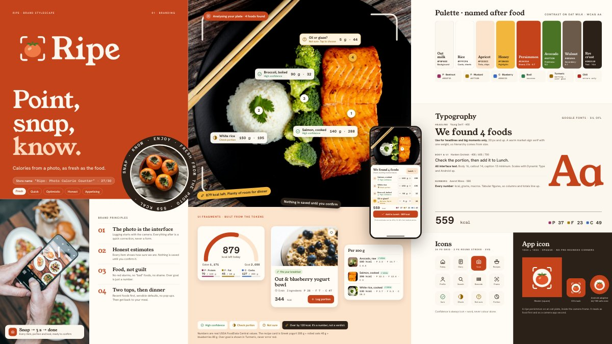
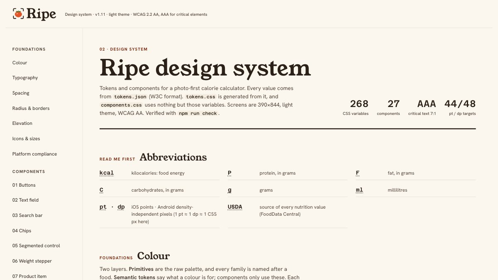
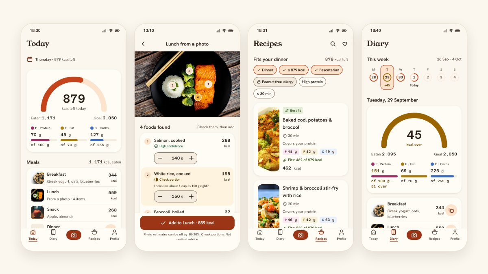
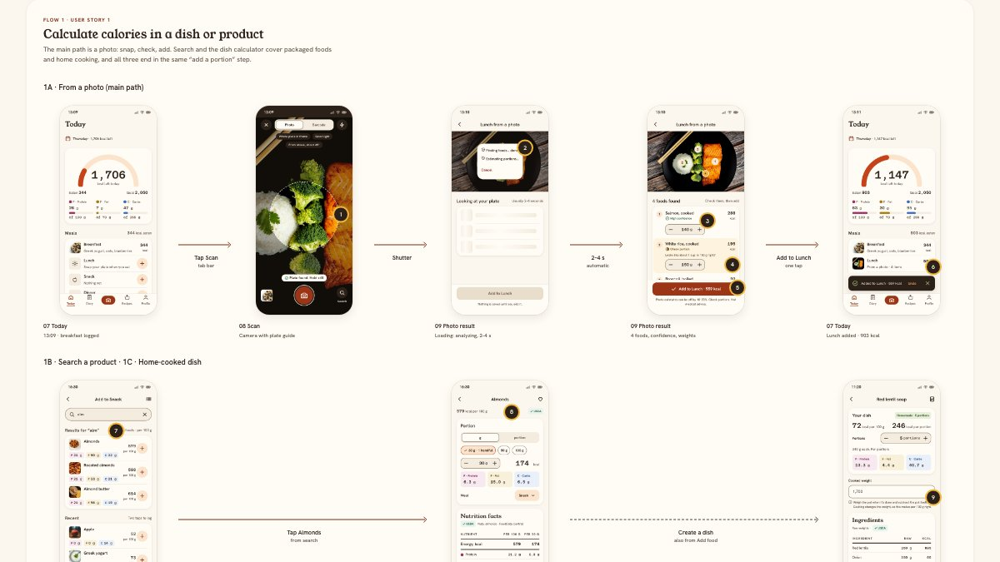

# Ripe: a photo-first calorie calculator

**Point, snap, know.** Ripe is a mobile calorie calculator that starts with a photo. You point your phone at your plate; Ripe finds each food, estimates the portion and says how sure it is. You check the numbers, tap once, and get back to your meal.

This is my submission for the trainee designer test task ([jito-dev/trainee-designer-apr-2026-test-task](https://github.com/jito-dev/trainee-designer-apr-2026-test-task)): a mobile app for calculating calories, covering two user stories:
1. Calculate the calories in a dish or product.
2. Find recipes that suit me.

Everything was made AI-natively: as HTML and CSS with Claude Code, with no hand-drawn Figma work, and exported to PNG with Playwright. At the end, Claude Code also exported the final screens to [Figma](https://www.figma.com/design/Xo47SGfRZervjkNEHIjE0D/Ripe-%E2%80%94-calorie-calculator-screens) as editable layers ([how](PLAN-FIGMA.md)).

## Links

| What | Link |
|---|---|
| **Landing page** | [nataperedrii.github.io/calories-calculator-design](https://nataperedrii.github.io/calories-calculator-design/) |
| **Brand stylescape** | [01-branding/stylescape.html](https://nataperedrii.github.io/calories-calculator-design/01-branding/stylescape.html) |
| **Design system** | [02-design-system/index.html](https://nataperedrii.github.io/calories-calculator-design/02-design-system/index.html) |
| **Clickable prototype** | [03-screens/index.html](https://nataperedrii.github.io/calories-calculator-design/03-screens/index.html) (phone frame, screen picker by flow, ← / →) |
| **Flows board** | [03-screens/flows.html](https://nataperedrii.github.io/calories-calculator-design/03-screens/flows.html) |
| **Figma file** | [Ripe — calorie calculator screens](https://www.figma.com/design/Xo47SGfRZervjkNEHIjE0D/Ripe-%E2%80%94-calorie-calculator-screens) (46 screens as editable layers; tokens as variables and styles; view only) |
| **Video walkthrough** | *Coming soon* |

All external links are also in [LINKS.md](LINKS.md).

The site is published with GitHub Pages from `main` and works in incognito: no sign-in, only repository files and Google Fonts. Every page also works offline: open [index.html](index.html) from a clone.

## Previews

**01 · Brand stylescape**

[](01-branding/stylescape.html)

**02 · Design system**

[](02-design-system/index.html)

**03 · Key screens**

[](03-screens/index.html)

**03 · Flows board**

[](03-screens/flows.html)

## Concept

**The problem.** Calorie apps feel like spreadsheets: you type, search and scroll. People give up, especially with home cooking, where nobody knows the calories of their own soup.

**The idea.** In Ripe, the photo is the interface. Logging starts with the camera, and everything after it is a quick check, never a form.

**Who it's for.** Busy adults (24–40) who eat a mix of home cooking and takeaway. They want a fast estimate they can trust and fix, not a diet coach telling them off.

**Four brand principles:**
1. **The photo is the interface.**
2. **Honest estimates.** Every detected food shows how sure Ripe is (High · Check portion · Not sure), and nothing is saved until you confirm it.
3. **Food, not guilt.** There are no red alarms or "bad" foods. Going over the goal is shown in a calm Turmeric, as a number with the word "over".
4. **Two taps, then dinner.** Recents first, sensible defaults, no pop-ups.

**Look and feel.**
- **Colours** are named after food: Oat milk, Rice, Rye crust, Persimmon, Avocado.
- **Fonts:** Young Serif for headlines, Hanken Grotesk for UI, Azeret Mono for every number.
- **Photos:** real food photos.

**How it answers the two stories:**
- **Story 1, calories in a dish or product:** three ways in, all ending in one "add a portion" step:
  - a photo of the plate (with confidence per food);
  - search or barcode, with values per 100 g from USDA FoodData Central;
  - a home-cooked dish calculator: raw ingredients plus the cooked weight.
- **Story 2, recipes that suit me:**
  - Recipes are ranked by what fits the calories and protein left today.
  - Your diet and allergies are hard filters, and hidden recipes are explained.
  - A recipe logs in two taps.

**Persona and data.** Sam: 2,050 kcal a day (P 100 · F 70 · C 255 g), pescatarian, allergic to peanuts. Every number on every screen comes from USDA FoodData Central per 100 g, scaled to the portion, and the screen generator asserts that the totals add up.

**What's built:**
- **16 screens in 46 states:** onboarding, Today, Scan, Photo result, Add food, Food detail, Dish calculator, Recipes, Dish detail (with editing), Diary and Profile.
- **A design system** of 268 CSS variables (from `tokens.json`) and 27 components.
- **Accessibility, checked automatically in headless Chromium:**
  - all 46 screens pass axe-core WCAG 2.2 A/AA, plus 44 px targets, keyboard focus, 320 px width and 200 % text (`check:screens`);
  - the design-system page also passes pa11y, a contrast scan and AAA checks for critical elements, such as 7:1 contrast for calories and macros (`check:a11y`).

  I also looked at screenshots at 390 and 320 px by eye. **Not verified yet:** real iOS and Android devices, VoiceOver and TalkBack.

## How I used Claude Code

Every step was a prompt to Claude Code; the full list is in [process/PROMPTS.md](process/PROMPTS.md). It has the prompt for each of the 23 steps, from research to the Figma export, and a short summary of what came out. The prompts are verbatim, checked against the session transcript, with three noted exceptions:
- step 01's folder tree (it had Ukrainian notes) is not reproduced; its English version is in CLAUDE.md;
- step 04's one-line side note is given in English;
- private details are masked as `[redacted]`.

Short answers to Claude's questions are summarised under "Clarification".

The reports with before/after images and check results are in [process/CHANGELOG.md](process/CHANGELOG.md).

**Rules first.** [CLAUDE.md](CLAUDE.md) sets the rules Claude Code follows in this repo:
- English only.
- Real USDA data that adds up.
- 390 × 844 screens exported at @2x.
- Screens may use **only** the design-system tokens and components: anything missing goes into the design system first.
- Every step is logged.

**The order of work:**
1. **Research:** MyFitnessPal, Yazio, Lifesum and FatSecret → [5 insights](process/research.md).
2. **Brand:** directions, the chosen Ripe brand ([BRAND.md](01-branding/BRAND.md)) and the stylescape.
3. **Design system:** [tokens.json](02-design-system/tokens.json) (W3C format) as the single source → `tokens.css` and [components.css](02-design-system/components.css), plus the [documentation page](02-design-system/index.html).
4. **Screens:** a spec first ([FLOWS.md](03-screens/FLOWS.md)), then the screens.
5. **Figma export:** the rendered screens are rebuilt in Figma as editable layers through the Figma MCP connector, within a strict budget of 10 calls on the free plan ([PLAN-FIGMA.md](PLAN-FIGMA.md)).

**Generated, not drawn.** [build_screens.py](03-screens/tools/build_screens.py) holds the USDA data, computes every portion and total, and writes all screens and the flows board. To change a screen, I edit the generator, not the HTML.

**Verified, not assumed.** Each step ended with a browser check: render → screenshot → look → measure → fix. These checks run automatically:

| Command | What it checks | Result now |
|---|---|---|
| `npm run check` | Design system: tokens, lint, HTML, contrast, clipping, touch targets, geometry at 100 % and 200 % text, axe; then grid alignment on every screen at 390 and 320 px | 61 / 61, 0 alignment deviations |
| `npm run check:screens` | Every screen: HTML, the design-system-only rule, links, axe, the 390 × 844 frame, clipping, 44 pt targets, keyboard, numbers that add up, and behaviour tests (editing, servings, onboarding, Diary, Profile, the prototype shell over http) | 610 / 610 |
| `npm run check:a11y` | The design-system page: WCAG 2.2 A/AA (Tier 1) and AAA for critical elements (Tier 2) | Tier 1: 0 failures (39 checks); Tier 2: 0 failures (9 checks) |

**Honest about gaps.** [PLAN-AUDIT.md](PLAN-AUDIT.md) audits the screens plan against the project item by item, with evidence. Open questions are listed there instead of being guessed.

## Repository structure

```
calories-calculator-design/
├── index.html              ← landing page (GitHub Pages)
├── README.md               ← this file
├── LINKS.md                ← all external links
├── CLAUDE.md               ← the rules Claude Code follows in this repo
├── PLAN-AUDIT.md           ← the screens plan vs the project, with evidence
├── PLAN-FIGMA.md           ← Figma export: limits with sources, budget, call log, manual fixes
├── previews/               ← preview images for this README and the landing page
├── 01-branding/
│   ├── BRAND.md            ← brief and rationale: audience, personality, colours, fonts
│   ├── directions.html/.png← 2 creative directions
│   ├── stylescape.html/.png← the final stylescape (3840 × 2160)
│   └── assets/             ← logo, app icons, photos (CREDITS.md)
├── 02-design-system/
│   ├── tokens.json         ← source of truth (W3C design tokens)
│   ├── tokens.css          ← generated CSS variables
│   ├── components.css      ← 27 components with all states
│   ├── index.html          ← documentation page (+ standalone version)
│   ├── README.md           ← overview, WCAG contrast table, changelog
│   ├── design-system.png   ← the docs page as one image
│   ├── tools/              ← checks, accessibility audit, exports
│   └── qa/, a11y/          ← check and audit reports
├── 03-screens/
│   ├── FLOWS.md            ← user flows: every screen, purpose, content, states
│   ├── index.html          ← clickable prototype: phone frame + screen picker (+ prototype.css)
│   ├── screens/            ← 46 HTML screens at 390 × 844 (+ js/dish-editor.js)
│   ├── exports/            ← the same screens as PNG @2x (780 × 1688)
│   ├── flows.html/.png     ← flows board with arrows and annotations
│   ├── tools/              ← generator, exports, checks, grid alignment, before/after
│   └── qa/                 ← check reports and before/after images
├── process/
│   ├── PROMPTS.md          ← every prompt, verbatim, and what came out of it
│   ├── CHANGELOG.md        ← step-by-step change reports
│   └── research.md         ← competitor analysis → 5 insights
├── figma-export/           ← Figma export data: layer trees, the batches sent, reports with node ids
└── tools/                  ← token build, docs build, contrast check, previews; figma/ = the Figma export
```

**Rebuild and check everything:** Node 20+ and Python 3. Run `npm install` once, then:

```bash
python3 tools/build_tokens.py && python3 tools/build_docs.py && npm run build:screens
npm run export:screens && npm run export:png && node tools/previews.mjs
npm run check && npm run check:screens && npm run check:a11y
```

## Known limitations & next steps

The design is frozen for review, so these are listed rather than fixed.

| Limitation | What I'd do next |
|---|---|
| **Prototype dead ends.**<br>• "Analyzing" doesn't move on to the photo result.<br>• "Save dish" and "Log a portion" in the dish calculator go nowhere.<br>• "Add to Snack" returns to search instead of Today.<br>Every screen still opens from the [prototype shell](03-screens/index.html) (picker, Next / Previous). | Add the three links in the generator: auto-advance after "Analyzing", and both dish-calculator buttons → Today with a toast. |
| **Missing error states:** photo not recognised, camera permission denied, empty search, empty Recipes, empty Diary. They are specified in [FLOWS.md](03-screens/FLOWS.md) but not drawn. | Build them from the existing empty-state and banner components, starting with "We couldn't recognise this photo" → search. |
| **Recipes filter chips wrap to three rows** on a 390 px phone (an open question in [PLAN-AUDIT.md](PLAN-AUDIT.md)). | Make the chip row scroll sideways in one line. |
| **Recipe cards show kcal twice** ("Fits: 462 of 879 kcal" and "462 kcal"), next to a narrow full-height photo. | Keep one kcal value, and try a wider photo. |
| **The design-system page says "24 components"** in its meta description and section heading; it documents 27. | Correct the count in both places. |
| **Some photos only approximate the recipe**, for example the cod and the shrimp dish. | Shoot or generate photos of the exact recipes. |
| **Tested only in headless Chromium.** No real iOS or Android devices, no VoiceOver or TalkBack. | A pass on an iPhone and an Android phone with VoiceOver and TalkBack. |

Also next:
- **Record the video walkthrough** and add its link here, in LINKS.md and on the landing page.
- **Test with five people** from the target group: sign-up, a photo log and finding a recipe. Measure time-to-log and how often a portion gets corrected.
- **Close the open questions** in [PLAN-AUDIT.md](PLAN-AUDIT.md), for example whether to keep USDA kcal and drop the ±2 % Atwater rule.
- **Finish the Figma file by hand:** Auto Layout components for button, chip, product row and recipe card, with the existing variables and styles bound ([PLAN-FIGMA.md §5](PLAN-FIGMA.md)).
- **More of the system:**
  - Android variants of the screens (48 dp targets and Material bars are already in the design system);
  - a dark theme;
  - Dynamic Type at the largest sizes.
- **Before a store release:** a proper trademark clearance for the name "Ripe"; so far there's only a quick knock-out search ([BRAND.md §12](01-branding/BRAND.md)).

## Credits

- **Nutrition data:** USDA FoodData Central (SR Legacy).
- **Photos:** Unsplash, Pexels and Pixabay under their licences, with authors listed in [01-branding/assets/CREDITS.md](01-branding/assets/CREDITS.md).
- **Fonts:** Young Serif, Hanken Grotesk and Azeret Mono (SIL Open Font License).
